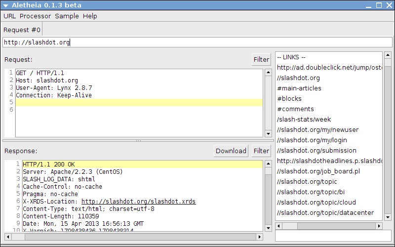
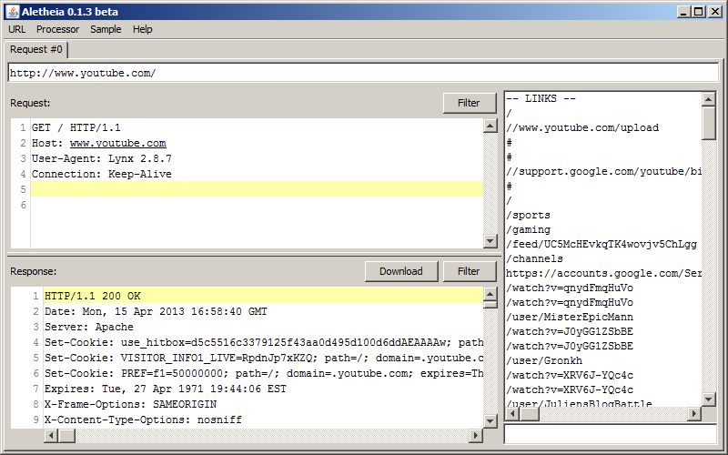

Aletheia
========

Welcome, Aletheia is a web browser like application to send raw http requests
written in java. It is designed for debugging and finding security issues in web
applications. It is possible to apply filters on every request and response
which can modify the content. The easiest way to get started with Aletheia is to
download the current version and run it with the following command:

```
java -jar aletheia.jar
```

## Features at a glance

* Written in Java, so it runs on Mac OS X, OS/2, Unix, VMS and Windows
* Send raw http requests where you can modify every byte
* Save/Open requests in an XML format
* Apply filters on http request/response i.e. (Basic authentication, OAuth)
* DNS lookup tool
* Html form and link parser
* Tabs for multiple requests

## Screenshots

### Debian


### Windows


## Milestones

* 03.01.2016 - Release of version 0.1.7 beta
* 25.12.2014 - Release of version 0.1.6 beta
* 15.11.2013 - Release of version 0.1.5 beta
* 21.07.2013 - Release of version 0.1.4 beta
* 15.04.2013 - Release of version 0.1.3 beta
* 01.01.2013 - Release of version 0.1.2 beta
* 15.10.2012 - Release of version 0.1.1 beta
* 03.10.2012 - Release of version 0.1.0 beta
* 25.05.2012 - Release of version 0.0.9 beta
* 13.05.2012 - Release of version 0.0.8 beta
* 15.10.2011 - Release of version 0.0.7 beta
* 18.09.2011 - Release of version 0.0.6 beta
